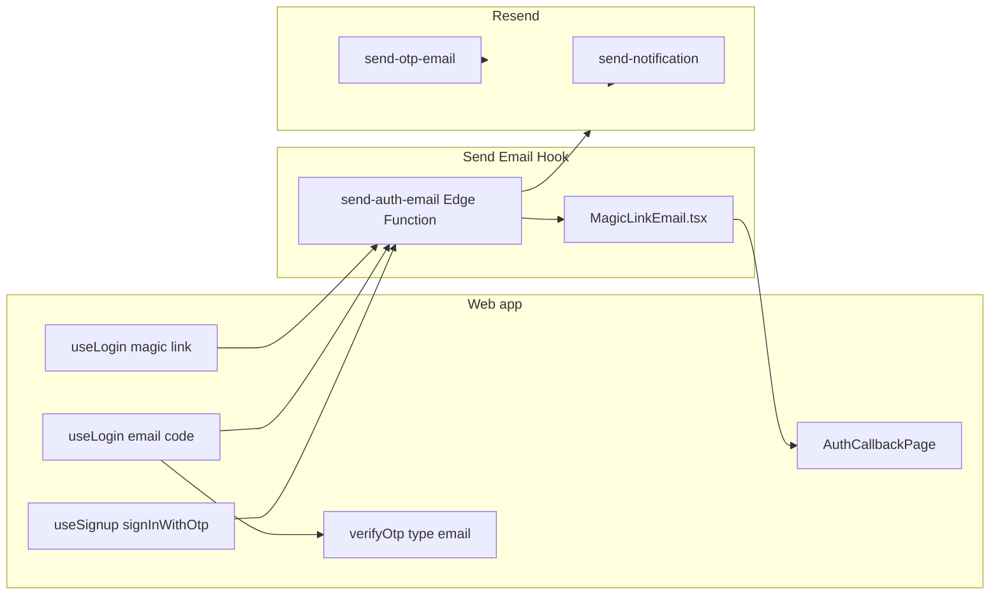

# Auth Email & Magic Link Setup

This guide covers **Supabase Auth emails** (magic-link login/signup). Transactional emails (`send-otp-email`, `send-notification`) use the same React Email templates in `packages/shared` via Resend.

## Architecture



| Email type | Sent by | Config location |
| --- | --- | --- |
| Magic link login/signup + login code | `send-auth-email` (Send Email Hook) | Dashboard → Auth → **Hooks** → Send Email; secrets below |
| Enrolment OTP codes | `send-otp-email` Edge Function | `RESEND_API_KEY`, `NOTIFICATION_FROM_EMAIL` |
| Class/notification emails | `send-notification` Edge Function | Same Resend secrets |

Templates live in [`packages/shared/src/email-templates/`](../../packages/shared/src/email-templates/). Preview locally: `pnpm email:preview magic_link`.

## What "Error sending magic link email" means

Supabase Auth accepted the magic-link request but **failed while sending the email**. Common causes:

1. **No custom SMTP on a hosted project** — built-in mailer is unreliable for production and often fails outside Supabase team inboxes.
2. **Custom SMTP misconfigured** — wrong host/port/credentials or unverified sender domain.
3. **Rate limits** — too many auth emails in a short window.
4. **Template error** — broken Magic Link email template in the dashboard.

The dashboard error is generic. Always check **Dashboard → Auth → Logs** for the underlying provider message.

## Quick diagnosis script

From repo root (requires service role key from Dashboard → Project Settings → API):

```bash
SUPABASE_URL=https://YOUR_PROJECT.supabase.co \
SUPABASE_SERVICE_ROLE_KEY=eyJ... \
TEST_EMAIL=miriamrstern@gmail.com \
APP_CALLBACK_URL=http://localhost:5173/auth/callback \
node scripts/check-auth-email-setup.mjs
```

Skip the send test and only print the checklist:

```bash
SKIP_SEND=1 SUPABASE_URL=... SUPABASE_SERVICE_ROLE_KEY=... node scripts/check-auth-email-setup.mjs
```

Or via package script:

```bash
pnpm auth:check-email
```

## Phase 1 — Verify dashboard settings

### URL configuration (Auth → URL Configuration)

| Setting | Value |
| --- | --- |
| Site URL | Production app origin, e.g. `https://creativeballet.example.com` |
| Redirect URLs | Every callback the app uses |

Required redirect URLs for this project:

```
http://localhost:5173/auth/callback
http://127.0.0.1:5173/auth/callback
https://YOUR_PRODUCTION_DOMAIN/auth/callback
```

The app sets `emailRedirectTo` to `${window.location.origin}/auth/callback` in `useLogin.ts` and `useSignup.ts`.

### Email provider (Auth → Providers → Email)

- Email provider **enabled**
- For login, the app uses `shouldCreateUser: false` — user must already exist in `auth.users`
- For signup, the app uses `shouldCreateUser: true` — new users trigger `handle_new_user` to create `user_profiles`

### Custom SMTP vs Send Email Hook (important)

These are **two different send paths**. Enabling custom SMTP does **not** fix a failing Send Email hook.

| Send Email hook | Custom Auth SMTP | Who sends the login email? |
| --- | --- | --- |
| **Enabled** | On or off | **`send-auth-email`** → Resend API (`RESEND_API_KEY`). SMTP settings are ignored for hook delivery. |
| **Disabled** | **On** | Supabase Auth → your SMTP (e.g. Resend SMTP). Uses dashboard **Magic Link** template (plain HTML). |
| **Disabled** | Off | Supabase built-in mailer (~2–3 emails/hour, dev only). |

If you see **hook 500** or **unexpected_failure from hook**, fix the hook (secrets + Edge Function logs) **or** disable the hook to test custom SMTP alone.

### Send Email Hook (production — branded auth emails)

When the hook is enabled, Supabase **does not** send dashboard HTML templates. The [`send-auth-email`](../../supabase/functions/send-auth-email/index.ts) Edge Function loads pre-built HTML from [`MagicLinkEmail.tsx`](../../packages/shared/src/email-templates/MagicLinkEmail.tsx) (rendered at deploy time via `pnpm email:bundle`) and sends via Resend — React Email does not run inside Deno.

1. Build, bundle, and deploy (from repo root):
   ```bash
   pnpm deploy:email-functions
   ```
   This deploys `send-auth-email`, `send-otp-email`, and `send-notification`. Verify in Dashboard → Edge Functions that `send-auth-email` appears.
2. Push secrets to the **hosted project** (local `.env` is not enough):
   ```bash
   pnpm secrets:email
   ```
   Requires `RESEND_API_KEY`, `NOTIFICATION_FROM_EMAIL`, and `SEND_EMAIL_HOOK_SECRET` in `.env` (one variable per line, no `\` line breaks).
3. Dashboard → **Authentication → Hooks** → **Send Email** → type **HTTPS**
4. URL: `https://YOUR_PROJECT.supabase.co/functions/v1/send-auth-email` (replace `YOUR_PROJECT` with your ref, e.g. `acmujrhavgbamdilzuew`)
5. Click **Generate Secret**, copy the full value (`v1,whsec_...`), put it in `.env` as `SEND_EMAIL_HOOK_SECRET=...`, then run `pnpm secrets:email`
6. Optional: `DEFAULT_TENANT_ID` if auth users lack `user_metadata.subdomain` (defaults to seed tenant).

**Unblock login while fixing:** Auth → Hooks → disable the Send Email hook temporarily. Auth will use the dashboard Magic Link template again until the function is deployed.

The hook email includes:

| Content | Source |
| --- | --- |
| Sign-in button link | Built from `token_hash` + `redirect_to` (same as `{{ .ConfirmationURL }}`) |
| 6-digit code (Code tab) | `email_data.token` when present |
| School branding | Tenant from `user_metadata.subdomain` or `user_profiles` |

| Tab | What the user does | Redirect |
| --- | --- | --- |
| Magic Link | Click **Sign In** in the email (same browser/profile) | `/auth/callback?code=...` |
| Code | Paste/type the code from the email (any device) | No callback — `verifyOtp` in the app |

### Fallback: dashboard Magic Link template (hook disabled)

If the Send Email Hook is **not** enabled, Supabase uses the dashboard template. Edit **Authentication → Email Templates → Magic Link** and include both `{{ .Token }}` and `{{ .ConfirmationURL }}` (see [Supabase docs](https://supabase.com/docs/guides/auth/auth-hooks/send-email-hook)).

### Auth logs (Auth → Logs)

Filter by:

- Endpoint: `magiclink` or `/otp`
- Email: `miriamrstern@gmail.com`

Capture the full error message before changing SMTP settings.

## Phase 2A — Dev path (unblock local testing)

### Local Supabase (`supabase start`)

1. Reset DB with seed data:
   ```bash
   pnpm db:reset-local
   ```
2. Start the web app:
   ```bash
   pnpm dev
   ```
3. Open login at `http://localhost:5173/login`, enter `miriamrstern@gmail.com`, choose magic link.
4. View captured emails at **http://127.0.0.1:54324** (Inbucket).

Local seed creates `auth.users` for `miriamrstern@gmail.com` with password `devpassword123` (password login also works locally).

### Hosted dev project

1. Apply migrations through `016` (auth trigger).
2. Create the parent auth user:
   ```bash
   SUPABASE_URL=... SUPABASE_SERVICE_ROLE_KEY=... pnpm seed:auth-parent
   ```
3. Re-run [`supabase/seed.sql`](../../supabase/seed.sql) in SQL Editor (or `supabase/scripts/link-parent-user.sql` if UUID differs).
4. Verify linkage:
   ```bash
   psql $DATABASE_URL -f supabase/scripts/verify-seed.sql
   psql $DATABASE_URL -f supabase/scripts/verify-auth-setup.sql
   ```
5. Run `pnpm auth:check-email` to test dashboard-equivalent magic link send.

Until custom SMTP is configured, hosted magic links may still fail — that is expected.

## Phase 2B — Production SMTP (Resend)

Configure **Auth → SMTP Settings → Enable custom SMTP**:

| Field | Value |
| --- | --- |
| Host | `smtp.resend.com` |
| Port | `465` (SSL) or `587` (STARTTLS) |
| Username | `resend` |
| Password | Your Resend API key (`re_...`) |
| Sender email | `noreply@your-verified-domain.com` |
| Sender name | e.g. `Creative Ballet Academy` |

### Domain verification (Resend dashboard)

1. Add your sending domain in Resend.
2. Add DNS records (SPF, DKIM; DMARC recommended).
3. Wait for verification before sending to real users.
4. Send test magic links to Gmail and one non-Gmail inbox.

### Edge Function secrets

Auth hook + transactional functions share Resend:

```bash
supabase secrets set \
  RESEND_API_KEY=re_... \
  NOTIFICATION_FROM_EMAIL="Creative Ballet <noreply@your-domain.com>" \
  SEND_EMAIL_HOOK_SECRET="v1,whsec_..."
```

Use the same verified domain for consistent branding. `SEND_EMAIL_HOOK_SECRET` is only required when the Send Email Hook is enabled.

## Phase 3 — End-to-end login verification

### Login (existing user)

**Magic link tab**

1. User exists in `auth.users` (seed or `seed:auth-parent`).
2. Login page → Magic Link tab → `shouldCreateUser: false`.
3. Email link opens `/auth/callback?code=...` (same browser/profile as the request).
4. `AuthCallbackPage` calls `exchangeCodeForSession`.
5. `useCurrentUser` loads profile; redirect to `/dashboard`.

**Code tab (cross-device)**

1. User exists in `auth.users`.
2. Login page → Code tab → enter email → **Send code** (`signInWithOtp`, no `emailRedirectTo`).
3. Email arrives with 6-digit `{{ .Token }}` (Magic Link template must include it).
4. Enter code in app → `verifyOtp({ email, token, type: 'email' })`.
5. Redirect to `/dashboard` (no callback route).

Manual cross-device check: request code on desktop, enter digits on phone.

### Signup (new user)

1. Signup page → email channel → `shouldCreateUser: true` with `subdomain` in metadata.
2. `handle_new_user` trigger creates `user_profiles` with role `parent`.
3. Callback flow same as login.

### SQL sanity checks

Run in SQL Editor after seeding:

```sql
-- auth user exists
SELECT id, email, email_confirmed_at FROM auth.users WHERE email = 'miriamrstern@gmail.com';

-- profile linked
SELECT id, email, role FROM user_profiles WHERE email = 'miriamrstern@gmail.com';

-- guardian linked to families
SELECT * FROM family_members WHERE user_profile_id = '00000000-0000-0000-0000-000000000510';
```

Or use [`supabase/scripts/verify-auth-setup.sql`](../../supabase/scripts/verify-auth-setup.sql).

## Troubleshooting checklist

| Symptom | Check |
| --- | --- |
| `Unexpected status code returned from hook: 404` | **`send-auth-email` is not deployed.** Run `pnpm deploy:email-functions` (see below). Hook URL must be `https://YOUR_PROJECT.supabase.co/functions/v1/send-auth-email` |
| `auth/v1/otp` returns **500** right after enabling the hook | Same as 404/500 from hook — deploy function + set secrets on the **project** (not only local `.env`) |
| `auth/v1/otp` returns **429** | **Auth rate limit**, not “out of emails.” Wait ~60 minutes or raise limits in Dashboard → Auth → Rate Limits. Retrying login many times while the hook was broken often triggers this |
| Hook 500 after deploy | Dashboard → Edge Functions → `send-auth-email` → Logs. Run `pnpm test:auth-email-hook` locally for the real JSON error body |
| `Objects are not valid as a React child` in hook logs | **Fixed:** auth emails use pre-rendered HTML shells (`pnpm email:bundle` → `auth-email-shells/generated.ts`), not React in Deno. Redeploy `send-auth-email` after `pnpm email:bundle` |
| `WebhookVerificationError` / `No matching signature` | Regenerate secret in **Auth → Hooks → Send Email**, paste into `.env`, run `pnpm secrets:email` (do not regenerate hook again after syncing) |
| `Missing required headers` on curl test | Expected — only Auth sends webhook headers. Ignore curl 500s from `curl -d '{}'` |
| Hook 500 — Resend | Verify domain in Resend; `NOTIFICATION_FROM_EMAIL` must use that domain |
| Dashboard: "Error sending magic link email" | Auth → Logs; configure custom SMTP |
| App says "Check your email" but nothing arrives | Spam folder; Auth logs; SMTP sender domain |
| "User account not found" on login | User missing from `auth.users`; run `seed:auth-parent` |
| Callback: "link expired" | Link older than expiry; request new link |
| Callback: redirect error | Add callback URL to Auth redirect allowlist |
| Code tab: email arrives but no digits | Wrong template (use **Magic Link**, not Confirm signup); typo in `{{ .Token }}`; Site URL mismatch |
| Code tab: invalid/expired code | Request new code; check Auth logs; default OTP expiry ~1 hour |
| Magic link broken after template edit | Use `{{ .ConfirmationURL }}` for the link — not `{{ .SiteURL }}/auth/callback?...` (Site URL mismatch → 404) |
| Magic link: PKCE verifier missing | Open link in the **same browser profile** that requested it; or use Code tab cross-device |
| Signup fails with database error | Auth trigger: tenant/subdomain missing in metadata |
| Works locally, fails on hosted | Hosted needs custom SMTP; local uses Inbucket |

## Related docs

- [Third-Party Services Setup](./THIRD_PARTY_SERVICES.md) — Resend, Twilio, Stripe
- [Manual Operations Runbook](../MANUAL_OPERATIONS_RUNBOOK.md) — day-2 operations
