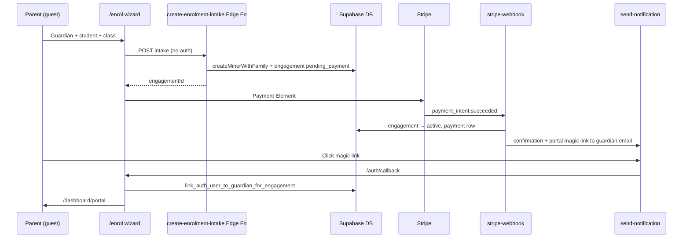

# Guest Enrollment & Parent Portal Provisioning

**Date:** 2026-06-02  
**Status:** ✅ Shipped (2026-06)  
**Depends on:** [2026-06-02-enrollment-flow.md](./2026-06-02-enrollment-flow.md) (context-aware student selection, `EnrolmentOnboardingService`)

---

## Executive summary

Make `/enrol` **guest-accessible** (industry-standard studio enrollment). Parents complete guardian + student details and pay **without logging in first**. Portal access is provisioned **after payment** via a confirmation email magic link — not during the wizard.

Admin enrolment remains the same wizard with search, offline payment, and payment-link flows.

---

## Industry-standard behaviour (target)

| Moment | Expected UX |
|--------|-------------|
| Browse `/classes` | Public, no auth |
| Start `/enrol` | **No login required** for new families |
| Returning family | Optional “Sign in to pick your children” (soft prompt, not a gate) |
| Step 1 (new) | Guardian name, **email (required)**, phone + student details |
| Step 1 (returning, signed in) | Child picker from account |
| Notifications | Skip during wizard; manage in portal later |
| Checkout | Confirm guardian email; Stripe Payment Element |
| After payment | Confirmation screen + email with receipt **and portal magic link** |
| First portal visit | Click email link → auth session → `/dashboard/portal` |
| Admin at desk | Same intake form + search + offline pay / send payment link |

**Login timing:** first meaningful login = **post-payment magic link** (or optional early sign-in for returning families only).

References: Jackrabbit, ClassForKids, Sawyer, Mindbody — all use guest-first enrollment and passwordless parent portal.

---

## Current state audit

### What works

- `EnrolmentOnboardingService.createMinorWithFamily()` — creates guardian person, account, student, `account_members` row (`account_holder`).
- Admin search + `StepSelectStudent` new-family form (guardian + student fields).
- `EnrolPayPage` — parent pays `pending_payment` engagement via admin-sent link.
- Auth trigger `handle_new_user()` — new auth users get `account_holder` role by default (programs preset).
- `DashboardRedirectPage` — parent roles → `/dashboard/portal`.

### What blocks industry-standard flow

| Issue | Location | Impact |
|-------|----------|--------|
| Login gate before wizard | `apps/web/src/pages/EnrolPage.tsx` L27–34 | Forces login at step 0; not guest-first |
| Family creation requires admin RLS | `people`/`accounts` INSERT policies | Guest cannot call `createMinorWithFamily` from browser |
| `linkAuthUserToPerson` at checkout | `EnrolmentStepper.tsx` L225–230 | Wrong timing + wrong actor (see below) |
| `EnrolPayPage` requires login | `EnrolPayPage.tsx` L26–32 | Payment link should work via magic link, not pre-login |
| No post-payment portal invite | Stripe webhook / `send-notification` | Parent never gets portal link automatically |
| Notification step still in wizard | `EnrolmentStepper.tsx` steps array | Extra friction (optional to remove in this plan) |

---

## Critical bug: `linkAuthUserToPerson` at checkout

### Current code

```typescript
// EnrolmentStepper.tsx — prepareCheckout onSuccess
if (user?.id && created.person_id) {
  await linkAuthUserToPerson(created.person_id); // student person_id
}
```

### What the RPC actually does

File: `supabase/migrations/20260526001700_rpcs.sql`

1. Accepts `p_person_id` (today: **student**).
2. Requires an engagement in `pending_payment | active | …` for that person.
3. For `programs` preset with `account_id`:
   - Updates **`account_members.user_profile_id`** for all `account_holder` / `member` rows on the student’s account.
   - Does **not** set `people.user_profile_id` on the student (correct for minors).
4. Does **not** verify auth email matches guardian email.
5. Does **not** skip `tenant_admin` users.

### Failure modes

| Scenario | Result |
|----------|--------|
| Guest checkout (no session) | Link never runs → parent never linked |
| Logged-in **tenant_admin** creates family | Admin auth UID linked to new family’s `account_members` → **data corruption** |
| Logged-in parent enrolls child | May work (links parent UID to account members) but implicit and fragile |
| Guardian email ≠ auth email | Link proceeds anyway → wrong person may get portal access |

### Industry-standard fix

**Remove** checkout-time linking from the stepper. Replace with **post-payment provisioning**:

1. Resolve **guardian** from engagement → student → `account_id` → `account_members` where `role = 'account_holder'`.
2. Link **only when** `lower(auth.email) = lower(guardian.email)`.
3. **Never** link when caller has `tenant_admin` role (unless also the guardian — rare).
4. Trigger from **payment success** (Stripe webhook or offline-payment path), not `pending_payment` creation.
5. Send confirmation email with magic link to **guardian email**.

### Recommended RPC changes

Add migration `20260526002100_portal_provisioning.sql`:

```sql
-- New: resolve guardian for an engagement (service + authenticated read)
CREATE FUNCTION resolve_engagement_guardian(p_engagement_id UUID) ...

-- Replace/extend linking:
CREATE FUNCTION link_auth_user_to_guardian_for_engagement(p_engagement_id UUID)
RETURNS VOID
-- 1. Require auth.uid()
-- 2. Load engagement → student → account → account_holder member → guardian person
-- 3. IF guardian.email IS NULL → RAISE
-- 4. IF lower(auth.users.email) <> lower(guardian.email) → RAISE (no link)
-- 5. IF user has tenant_admin AND NOT guardian match → RAISE (admin safety)
-- 6. SET account_members.user_profile_id = auth.uid() for account_holder row only
-- 7. Ensure user_profiles.role includes account_holder (or parent)

-- Service-role only (called from webhook after payment):
CREATE FUNCTION provision_portal_invite(p_engagement_id UUID)
RETURNS JSONB  -- { guardianEmail, guardianName, studentName, className, portalMagicLink? }
-- Validates engagement.status = 'active'
-- Does NOT create auth user — email sends magic link via Supabase Auth or send-notification
```

Deprecate direct calls with student `person_id` from the stepper. Keep `link_auth_user_to_person` for **adult solo** enrolments only (no `account_id`), or rename to clarify scope.

---

## Target architecture



---

## Implementation phases

Each phase is independently mergeable. Complete phases in order.

---

### Phase 1 — Stop harmful linking (hotfix)

**Goal:** Prevent admin mis-linking; remove incorrect checkout hook.

#### Tasks

1. **Delete** `linkAuthUserToPerson` call from `EnrolmentStepper` checkout `onSuccess` (`apps/web/src/features/enrolment/components/EnrolmentStepper.tsx`).
2. Add guard in `linkAuthUser.ts` comment + JSDoc: *“Do not call during admin enrolment or at pending_payment creation.”*
3. Add unit test documenting intended call sites (adult solo only, or post-payment guardian link).

#### Acceptance criteria

- [ ] Admin creating a new family no longer attaches admin UID to `account_members`.
- [ ] No `link_auth_user_to_person` calls from stepper checkout effect.
- [ ] Existing parent logged-in flow still works via Phase 3 linking.

#### Files

- `apps/web/src/features/enrolment/components/EnrolmentStepper.tsx`
- `apps/web/src/features/enrolment/linkAuthUser.ts`
- `apps/web/src/__tests__/enrolment-linking.test.ts` (new)

---

### Phase 2 — Guest-accessible `/enrol` UI

**Goal:** Public can start wizard; returning parents can optionally sign in.

#### Tasks

1. **`EnrolPage.tsx`**
   - Remove forced redirect to `/login` when `!user`.
   - Render `EnrolmentStepper` for guests.
   - Show optional banner: *“Already registered? Sign in to select your children”* → `/login` with preserved intent.

2. **`useEnrolmentContext.ts`**
   - Add mode `guest` (or treat `!user` as `guest`):
     - `mode === 'guest'` → show new-family form (guardian + student), no child list.
     - `mode === 'parent'` → requires auth (existing).
     - `mode === 'admin'` → requires auth + tenant_admin (existing).

3. **`StepSelectStudent.tsx`**
   - Guest mode: same UI as admin `new_family` (guardian section first, student second).
   - Require guardian email (HTML `required` + Zod).
   - Optional sign-in CTA at top.

4. **`EnrolmentStepper.tsx`**
   - Pass `guardianPersonId` / `accountId` from intake response through wizard state (needed for Phase 3).
   - Store `{ accountId, guardianPersonId, guardianEmail }` in component state after step 1.

5. **Remove notification step from default public path**
   - Set `skipNotificationStep={true}` on public `EnrolPage`, or drop step from steps array when `mode !== 'admin'`.

#### Acceptance criteria

- [ ] Unauthenticated user can complete step 1 (guardian + student) without redirect.
- [ ] Guardian email is required on new-family form.
- [ ] Logged-in parent still sees child picker.
- [ ] Admin flow unchanged.

#### Files

- `apps/web/src/pages/EnrolPage.tsx`
- `apps/web/src/features/enrolment/hooks/useEnrolmentContext.ts`
- `apps/web/src/features/enrolment/components/StepSelectStudent.tsx`
- `apps/web/src/features/enrolment/components/EnrolmentStepper.tsx`
- `apps/web/src/i18n/en.json`, `he.json`

---

### Phase 3 — Server-side guest intake (Edge Function)

**Goal:** Guest can persist family + `pending_payment` engagement without admin RLS.

#### Tasks

1. **Create** `supabase/functions/create-enrolment-intake/index.ts`
   - Auth: **anon allowed** with rate limit + tenant subdomain header/body validation.
   - Input (Zod):
     ```typescript
     {
       tenantSubdomain: string;
       offeringId: string;
       seasonId: string;
       guardian: { name: string; email: string; phone?: string };
       student: { name: string; dateOfBirth: string; gender?: string };
     }
     ```
   - Uses service-role client to run same steps as `EnrolmentOnboardingService.createMinorWithFamily` + `EnrolmentService.create` (`status: 'pending_payment'`).
   - Returns `{ engagementId, accountId, guardianPersonId, studentPersonId }`.

2. **Web client** — `apps/web/src/features/enrolment/intakeService.ts`
   - `createGuestIntake()` invokes edge function from step 1 submit (guest + admin new-family paths).

3. **Refactor** shared logic
   - Extract SQL operations from `onboardingService.ts` into shared module callable from edge function OR duplicate minimally with schema parity tests.

4. **RLS:** Do **not** add broad anon INSERT policies. All guest writes go through edge function (service role).

#### Acceptance criteria

- [ ] Guest can create family + engagement without authenticated Supabase session.
- [ ] Duplicate enrolment (same student+class+term) returns 409.
- [ ] Rate limit / basic abuse protection documented in function README.

#### Files

- `supabase/functions/create-enrolment-intake/index.ts` (new)
- `apps/web/src/features/enrolment/intakeService.ts` (new)
- `apps/web/src/features/enrolment/onboardingService.ts` (refactor optional)
- `packages/shared/src/schemas.ts` (intake request schema)

---

### Phase 4 — Guest checkout & payment

**Goal:** Pay without upfront login; Stripe webhook activates enrolment.

#### Tasks

1. **`EnrolmentStepper` checkout**
   - Guest path: engagement already created in Phase 3; skip client `createEnrolment` mutation.
   - Authenticated parent path: keep existing client create (RLS).

2. **`create-checkout` edge function**
   - Accept `engagementId` for guest checkout (validate `pending_payment`, tenant, amount).

3. **`EnrolPayPage`**
   - Allow **guest pay** OR magic-link auth:
     - Option A (preferred): Public pay page — email verification OTP before pay (same browser).
     - Option B: Send magic link in payment_reminder email; pay page works after one-click auth.
   - Remove hard login gate; replace with “Enter the email the studio has on file” if no session.

4. **Stripe webhook** (`stripe-webhook` or equivalent)
   - On `payment_intent.succeeded`: set engagement `active`, insert payment, call Phase 5 notify.

#### Acceptance criteria

- [ ] Guest completes Stripe payment end-to-end in dev.
- [ ] Webhook sets engagement to `active`.
- [ ] Admin offline payment path also triggers Phase 5 (see below).

#### Files

- `apps/web/src/features/enrolment/components/EnrolmentStepper.tsx`
- `apps/web/src/pages/EnrolPayPage.tsx`
- `supabase/functions/create-checkout/index.ts`
- `supabase/functions/stripe-webhook/index.ts` (or existing handler)

---

### Phase 5 — Post-payment portal provisioning (core)

**Goal:** Parent automatically gets portal via confirmation email magic link.

#### Tasks

1. **Migration** `20260526002100_portal_provisioning.sql`
   - Implement `link_auth_user_to_guardian_for_engagement(p_engagement_id UUID)` as specified in bug section.
   - Implement `resolve_engagement_guardian(p_engagement_id UUID)` helper.

2. **`AuthCallbackPage.tsx` / post-login hook**
   - After session established, if `sessionStorage.enrollmentIntent.portalEngagementId` set:
     - Call `link_auth_user_to_guardian_for_engagement`.
     - Redirect to `/dashboard/portal`.
   - Clear intent after success.

3. **Confirmation email** (template `enrolment_confirmation` or extend existing)
   - Variables: `guardianName`, `studentName`, `className`, `amount`, `invoiceUrl?`, **`portalUrl`** (magic link).
   - Magic link generation:
     - `supabase.auth.signInWithOtp({ email: guardianEmail, options: { emailRedirectTo: '/auth/callback?next=/dashboard/portal&engagementId=…' }})` from **service role** in edge function, OR
     - Use existing `send-auth-email` hook with Magic Link template.
   - Store `engagementId` in redirect URL or sessionStorage via callback query param.

4. **Trigger email from:**
   - Stripe webhook on success.
   - `AdminEnrolmentService.recordOfflinePayment`.
   - `AdminEnrolmentService.sendPaymentLinkEmail` — update copy: “Pay and access your portal”.

5. **New edge function or extend `send-notification`**
   - `send-enrolment-confirmation` — loads engagement, resolves guardian, sends email.

#### Acceptance criteria

- [ ] After online payment, guardian receives email with portal link.
- [ ] First click creates auth user (if new) with `account_holder` role.
- [ ] `account_members.user_profile_id` set on **guardian** row only.
- [ ] Parent lands on `/dashboard/portal` seeing enrolled child.
- [ ] Admin who created the enrolment is **not** linked to the family.
- [ ] Email mismatch → link RPC rejects; user sees friendly error + support CTA.

#### Files

- `supabase/migrations/20260526002100_portal_provisioning.sql` (new)
- `apps/web/src/pages/AuthCallbackPage.tsx`
- `apps/web/src/features/enrolment/linkAuthUser.ts` (add `linkGuardianForEngagement`)
- `supabase/functions/send-notification/` or new function
- `packages/shared/src/email-templates/` (confirmation template)
- `apps/web/src/features/enrolment/lib/adminEnrolmentService.ts`

---

### Phase 6 — Returning parent optional login

**Goal:** Signed-in parents skip re-entering guardian details.

#### Tasks

1. Step 1 soft sign-in (already in Phase 2 banner).
2. After login mid-wizard, reload context → parent mode with child list.
3. Persist wizard draft in `sessionStorage` (`enrolmentDraft`) across login redirect.

#### Acceptance criteria

- [ ] Parent can sign in from step 1 and pick existing child without re-entering guardian info.
- [ ] Class selection + checkout continue seamlessly after redirect.

---

### Phase 7 — Tests, docs, SPEC

#### Tasks

1. **Unit tests**
   - `link_auth_user_to_guardian_for_engagement` — email match, admin blocked, guardian linked.
   - Guest intake schema validation.
   - `useEnrolmentContext` mode matrix (guest / parent / admin).

2. **E2E / regtest scenarios**
   - Guest: class card → enrol → guardian form → pay → email → portal.
   - Admin: create family → send payment link → parent pays → portal.
   - Returning parent: sign in → pick child → pay.

3. **Update `SPEC.md`**
   - V1 wizard: guest-first, login post-payment.
   - Document RPCs and edge functions.
   - Remove “login required at /enrol” if documented.

4. **Update `docs/plans/2026-06-02-enrollment-flow.md`**
   - Cross-link this plan.

#### Acceptance criteria

- [ ] `pnpm run regtest` passes.
- [ ] SPEC matches implemented flow.

---

## Enrolment mode matrix (reference for agents)

| Auth | Role | Intent | Mode | Step 1 UI |
|------|------|--------|------|-----------|
| No | — | public | `guest` | Guardian + student form |
| Yes | parent roles | — | `parent` | Child list + add child |
| Yes | tenant_admin | `mode: admin` | `admin` | Search + create family |
| Yes | tenant_admin | no admin intent | `admin`* | *If staff without parent role |
| Yes | adult_student | — | `adult_student` | Skip / self |

\*Already implemented in `useEnrolmentContext.ts`.

---

## Wizard steps (target public flow)

```
Step 1  Who?     Guest: guardian + student | Parent: pick child | Admin: search/create
Step 2  Class    Skip if preselected from ClassCard
Step 3  Pay      Email confirm, Stripe, VAT summary
Step 4  Done     “Check {email} for confirmation and portal access”
```

**Removed from public default:** notification / OTP step (portal settings later).

---

## Data invariants (do not violate)

1. **One parent login → one account** (existing domain rule).
2. **Guardian email** is the portal identity (login email must match for self-service link).
3. **Students (minors)** never receive `user_profile_id` for portal login.
4. **`account_members.user_profile_id`** on `account_holder` row = portal login.
5. **Admin actions** never attach admin auth UID to customer families.

---

## AI agent execution notes

When implementing a phase:

1. Read this plan + `SPEC.md` §5 Auth + V1 enrolment wizard.
2. Read schema in `supabase/migrations/20260526000200_people.sql`, `20260526001100_engagements.sql`, `20260526001700_rpcs.sql`.
3. Run `pnpm -C apps/web exec tsc --noEmit` after TypeScript changes.
4. Run targeted tests listed in Phase 7.
5. Do **not** add anon RLS write policies on `people` / `accounts` — use edge functions.
6. Do **not** call `link_auth_user_to_person(studentId)` from checkout.
7. Prefer extending existing `send-notification` over new email pipeline.
8. i18n: add keys under `pages.enrolment.*` in `en.json` and `he.json`.
9. Keep admin and guest intake forms visually consistent (guardian first, student second).

### Suggested PR split

| PR | Phases |
|----|--------|
| PR1 | Phase 1 (hotfix linking) |
| PR2 | Phase 2 (guest UI + mode) |
| PR3 | Phase 3 (intake edge function) |
| PR4 | Phase 4 (guest checkout) |
| PR5 | Phase 5 (portal provisioning + email) |
| PR6 | Phase 6–7 (returning parent polish + tests/docs) |

---

## Open decisions (defaults chosen)

| Question | Decision |
|----------|----------|
| Guest pay on `/enrol/pay/:id` without login? | **Yes** — verify guardian email on page OR magic link from email |
| Create auth user before payment? | **No** — industry standard post-payment invite |
| OTP during wizard? | **No** — defer to portal |
| Adult self-enrol guest path? | **Out of scope** — adult solo can sign in with magic link first (existing) |
| CAPTCHA on intake edge function? | **Recommended** before production; optional in dev |

---

## Success metrics

- New family can enrol from `/classes` → pay in **one session** without creating a password.
- 100% of successful payments trigger confirmation email with portal link.
- Zero admin UID rows in `account_members` for families they created on behalf of parents.
- Returning parents who sign in at step 1 never re-enter guardian details.
