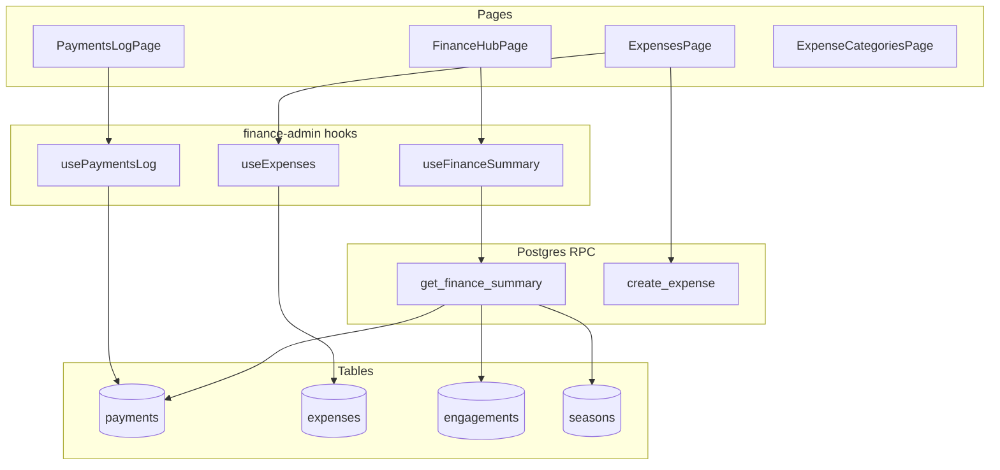

# Admin dashboard finance — Overview (Stages F1–F6)

**SPEC:** Phase 1F — Admin dashboard (finance slice)  
**Status:** Planned — audited 2026-06-24 (second pass), agent-ready  
**Normative:** [SPEC.md §6 Phase 1F](../../SPEC.md) · **Contracts:** [CONTRACTS.md](CONTRACTS.md) (locked) · **Audit:** [AUDIT-REPORT.md](AUDIT-REPORT.md)

Operational finance under `/admin/finance` — **not** `/admin/setup/*` (configuration).

## Agent entry point

1. Read [CONTRACTS.md](CONTRACTS.md) (mandatory).
2. Read this file + active `stage-fN-*.md`.
3. Read `.instructions.md` (deterministic finance; no AI in money logic).
4. Run `pnpm finance-admin:prompt fN` and paste into Agent.

Rule file: `.cursor/rules/admin-finance-stages.mdc`.

## Out of scope

| Item | Tracker |
| --- | --- |
| Grow live sandbox charge | [finance G7](../finance/stage-g7-settings-cleanup.md) — **blocked** (no Meshulam sandbox / business registration). Use `mock/mock` + walkthrough. |
| Notification blast | Separate Phase 1F track |
| Today's classes / occupancy overview | Future admin overview plan |
| V2.7 accountant API export | F6 includes basic CSV only |
| AI receipt OCR | V3 |

## Already shipped (do not re-implement)

Payment spine, `RecordPaymentModal` / `RefundPaymentModal` on admin `StudentSlideOver`, parent payment history, `expense_categories` + Zod, finance walkthrough, Grow settings UI (code complete; live verify deferred).

## Stage map

| Stage | Focus | SQL migration | Doc |
| --- | --- | --- | --- |
| F1 | Routes, nav, hub shell | None | [stage-f1-shell.md](stage-f1-shell.md) |
| F2 | Payments transaction log | None | [stage-f2-payments-log.md](stage-f2-payments-log.md) |
| F3 | Hub metrics RPC + outstanding list | **RPC only** `get_finance_summary` | [stage-f3-overview-metrics.md](stage-f3-overview-metrics.md) |
| F4 | `expenses` table, storage, `create_expense` RPC | **Full** | [stage-f4-expenses-schema.md](stage-f4-expenses-schema.md) |
| F5 | Expenses UI + categories admin + `logAudit` | None | [stage-f5-expenses-ui.md](stage-f5-expenses-ui.md) |
| F6 | P&L, period selector, CSV, polish | None | [stage-f6-pl-polish.md](stage-f6-pl-polish.md) |

## Architecture

## Hard rules

| Rule | Detail |
| --- | --- |
| One stage per session | Stop after DoD; no commit unless user requests |
| Contracts | [CONTRACTS.md](CONTRACTS.md) overrides stage prose if conflict |
| Feature root | `apps/web/src/features/finance-admin/` only |
| Schema | Never edit shipped migrations; new files under `supabase/migrations/` |
| F3 migration | RPC only — `get_finance_summary` |
| F4 migration | `expenses` + bucket + `create_expense`; **no direct INSERT grant** on `expenses` |
| Immutability | No UPDATE/DELETE on `payments`/`expenses` in UI; corrections via new rows |
| Aggregates | Never fetch all payments/expenses client-side for totals |
| Grow | All stages pass with `mock` tenant; live Grow not required |
| DB sync | `pnpm db:sync` only after F3 or F4 migration, after user confirms |

## Deferred — Grow live verification

- [ ] Sandbox credentials saved (`/admin/setup/grow`)
- [ ] ₪1 sandbox charge → webhook → `external_document_*`
- [ ] G7 DoD complete

## Completion report (every stage)

1. DoD checklist pass/fail per item  
2. Files changed (list)  
3. Commands run + outcomes  
4. Blockers  
5. **Stop** — wait for "commit Stage FN"
