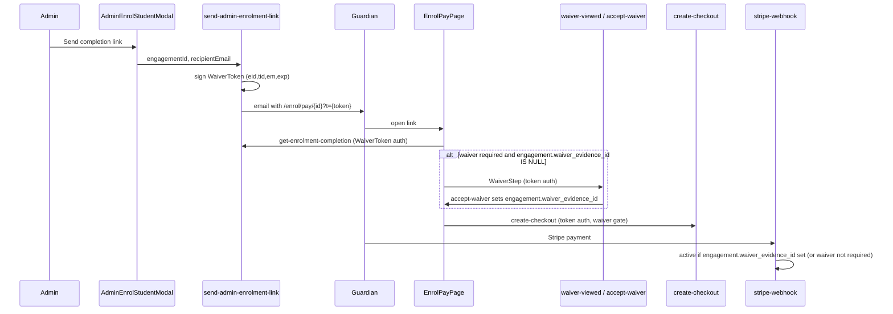

# Agent Implementation Plan: Admin Enrolment Completion Link + Enrolment-Scoped Waivers

> **Status:** Ready for implementation  
> **Last updated:** 2026-06-08  
> **Scope:** Admin “send completion link” (waiver → pay), engagement-scoped waiver gating, token security hardening  
> **Out of scope (this PR):** `people.waiver_*` column rename — see [Post-reset note](#post-reset-note-column-rename-not-now) at end

---

## Decisions Locked (do not reinterpret)

These decisions are finalized for this implementation pass.

1. **Template drift at checkout:** `requireActiveTemplateMatch = false` for checkout-time waiver validation.
   - Rationale: avoid breaking in-progress enrolments if template rotates.
   - Governance: add operational guardrail so waiver template activation during active signup season is blocked by default, with explicit admin override + audit when truly necessary.

2. **Admin recipient override policy:** **Allow override with mandatory reason + audit**.
   - Must capture: actor, engagement, resolved guardian email, override email, reason, timestamp, outcome.

3. **Login resume state storage:** **sessionStorage + server-side draft fallback**.
   - sessionStorage is primary fast-path; server draft is resilience path for tab loss/refresh/device/login redirects.
   - **Concrete storage contract:** use a dedicated table `enrolment_resume_drafts` with TTL cleanup.

4. **Guest token bootstrap ownership:** **single orchestration endpoint** (existing guest create/prepare flow) returns `engagementId + enrolmentToken` in one response.
   - Internal helper modularization is encouraged; no extra client round-trip for token issuance.

---

## Goal

When an admin enrols a student and chooses **“Send completion link by email”**, the guardian receives **one email with one tokenized link** to complete enrollment **without logging in**:

1. **Sign waiver** (if the class requires it) — waiver is bound to **this enrolment**, not the person globally
2. **Pay** via Stripe
3. Engagement becomes **`active`**

Additionally, fix waiver gating across the system so **no code path** treats “person signed a waiver once” as sufficient for a new enrolment.

---

## Flow Matrix (authoritative)

This matrix resolves auth/gating ambiguity across flows.

| Flow | User auth state | Checkout auth requirement | Waiver order | Expected status path |
|------|------------------|---------------------------|--------------|----------------------|
| Admin send-link | Unauthenticated guardian | **Valid WaiverToken required** | Sign -> Pay | `pending_payment` -> `active` |
| Guest self-enrol | Unauthenticated guest | **Valid WaiverToken required** (or authorized session) | Pay -> Sign (current) | `pending_payment` -> `pending_waiver` -> `active` |
| Authenticated parent/adult | Authenticated session | Existing JWT path | Sign -> Pay | `pending_payment` -> `active` |
| Admin pay-now (in studio) | Admin-assisted | Existing flow (out of scope here) | Existing behavior | Existing behavior |

**Guardrail:** token requirements apply to **all unauthenticated checkout actions** (admin send-link + guest self-enrol) while preserving guest UX order (`pay -> sign`) in this PR.

---

## Success Criteria

- [ ] Guardian completes waiver + payment from a single email link, no login
- [ ] Bare `/enrol/pay/{uuid}` URLs cannot access payment or waiver (token required)
- [ ] Waiver collected **before** payment when `waiver_required = true`
- [ ] `engagements.waiver_evidence_id` is the **only** gate for “waiver satisfied for this enrolment”
- [ ] Person-level evidence / `people.waiver_accepted_at` is **never** used for enrolment status decisions
- [ ] Stripe webhook sets `active` (not `pending_waiver`) when `engagement.waiver_evidence_id` is set pre-payment
- [ ] Token bound to **recipient (guardian) email**, not student `people.email`
- [ ] Existing guest and authenticated flows remain behaviorally unchanged (guest stays pay -> sign; authenticated stays sign -> pay)
- [ ] Auth rules are explicit per Flow Matrix and do not introduce cross-flow regressions
- [ ] Guest self-enrol now uses token-backed checkout without interrupting the in-progress flow
- [ ] If user chooses login mid-flow, app resumes to exact prior step with all form inputs preserved
- [ ] Tests cover token validation, engagement-scoped gating, status transitions

---

## Non-Goals (this PR)

- Admin pay-now inline waiver in modal (follow-up)
- Kiosk/QR waiver signing
- New email React template component (extend variables on existing template first)
- Guest self-enroll order change (still pay → sign)
- **`people.waiver_*` column rename** — documented at end; do not implement now

---

## Waiver Data Model (agent must follow)

| Layer | Role | Use for gating? |
|-------|------|-----------------|
| `waiver_evidence` | Immutable signed legal record (`person_id`, `offering_id`, signer metadata, HMAC) | Indirectly — via FK on engagement |
| `engagements.waiver_evidence_id` | **Which evidence covers this specific enrolment** | **YES — source of truth** |
| `people.waiver_accepted_at` / `waiver_version` | Denormalized cache of **latest** signature for the person | **NO — display/cache only** |

**Gate rule (implement everywhere):**

```text
Waiver satisfied for enrolment E  ⇔  E.waiver_evidence_id IS NOT NULL
                                      AND linked waiver_evidence.status = 'signed'
```

Do **not** query `waiver_evidence` by `person_id` alone to skip waiver for a new enrolment.

## Canonical Waiver Validity Rule (single source of truth)

Use this same rule in `create-checkout`, `stripe-webhook`, and completion endpoints:

```text
Waiver valid for engagement E iff:
1) E.waiver_evidence_id IS NOT NULL
2) evidence.id = E.waiver_evidence_id
3) evidence.tenant_id = E.tenant_id
4) evidence.person_id = E.person_id
5) evidence.offering_id = E.offering_id
6) evidence.status = 'signed'
```

Optional policy flag:
- `requireActiveTemplateMatch` (default false for this PR)
- If true, additionally require evidence template/version to match the active consent template at verification time.

For this PR:
- Admin send-link pre-pay path: `requireActiveTemplateMatch = false` (prevents forcing re-sign between sign and pay)
- Guest token-backed checkout path: `requireActiveTemplateMatch = false`
- Existing guest post-pay reminders/webhook behavior: unchanged

---

---

## Architecture



## State Machine (admin send-link path)

| Step | `engagements.status` | `waiver_evidence_id` |
|------|----------------------|----------------------|
| Admin creates enrolment | `pending_payment` | `null` |
| Guardian signs waiver | `pending_payment` | **set** |
| Guardian pays | `active` | set |
| No waiver required, pays | `active` | `null` |

**Do not** use `pending_waiver` in this path — that status is for post-payment guest signing only.

---

## Phase 0: Enrolment-Scoped Waiver Gating (PREREQUISITE — do first)

Fix person-level waiver checks before building admin token flow. Small diff, prevents legally incorrect activations.

### 0.1 Shared helper (Edge Functions)

**Create:** `supabase/functions/_shared/engagement-waiver.ts`

```typescript
/**
 * Returns true if this engagement has a linked signed waiver evidence row.
 * Optionally validates consent_template_id + version match active template.
 */
export async function engagementHasSignedWaiver(
  service: SupabaseClient,
  engagementId: string,
  tenantId: string,
  options?: { requireActiveTemplate?: boolean },
): Promise<{ satisfied: boolean; evidenceId: string | null }>
```

Logic:
1. Load `engagements.waiver_evidence_id` for `engagementId` + `tenantId`
2. If null → `{ satisfied: false, evidenceId: null }`
3. Join `waiver_evidence` — verify `status = 'signed'`
4. If `requireActiveTemplate`: verify template `status = 'active'` and version matches

### 0.2 Fix `stripe-webhook`

**File:** `supabase/functions/stripe-webhook/index.ts`

**Replace** person-level evidence lookup (lines ~163–171) with:

```typescript
if (offeringRow?.waiver_required) {
  const { satisfied } = await engagementHasSignedWaiver(service, engagementId, tenantId, {
    requireActiveTemplate: true,
  });
  if (!satisfied) {
    engagementStatus = "pending_waiver";
    waiverDeadline = /* +7 days */;
  }
}
```

**Do not** fall back to person-level evidence in this PR (keeps model consistent). Guest flows that pay before signing will correctly land in `pending_waiver`.

### 0.3 Fix `recordOfflinePayment`

**File:** `apps/web/src/features/enrolment/lib/adminEnrolmentService.ts`

**Replace** person-level evidence query with engagement-scoped check:

- After creating/updating engagement, check `engagement.waiver_evidence_id` (fetch engagement row)
- If `waiver_required` and `waiver_evidence_id` IS NULL → `pending_waiver`
- Else → `active`

Cannot use client-side person-level query anymore.

### 0.4 Audit: no other person-level gating

**Grep and fix any match:**

```bash
rg "waiver_evidence.*person_id|waiver_accepted_at" --glob "*.{ts,tsx,sql}"
```

Known locations:
- `stripe-webhook/index.ts` — fix in 0.2
- `adminEnrolmentService.ts` — fix in 0.3
- `PersonDetail.tsx`, `search_enrolment_students` — **display only, OK**

### 0.5 Tests for Phase 0

**Create:** `apps/web/src/__tests__/engagement-waiver-gating.test.ts` (or Edge Function unit test)

| Case | Expected |
|------|----------|
| Engagement A has `waiver_evidence_id`, new engagement B does not | B → `pending_waiver` after pay (webhook logic) |
| Engagement has `waiver_evidence_id` set | → `active` after pay |
| `waiver_required = false` | → `active` regardless |

### Phase 0 acceptance

- [ ] No production code uses person-level `waiver_evidence` lookup to decide enrolment status
- [ ] `sign_waiver()` may still update `people.waiver_accepted_at` (cache) — no logic reads it for gates

---

## Phase 1: Prerequisites & Decisions

**Reuse `WaiverToken` format** — `supabase/functions/_shared/waiver-token.ts`

- Payload: `{ eid, tid, em, exp }`
- Header: `Authorization: WaiverToken <token>`
- Do **not** invent a second crypto format
- Expiry: **7 days** from send

**Token issuance: server-side only** — never sign in `adminEnrolmentService.ts` (client)

**Env vars:** `WAIVER_LINK_SECRET`, `NOTIFICATION_FROM_EMAIL`, tenant `from_email`, `APP_URL`

**Tenant boundary (mandatory):**
- Do not trust `tenantId` from client body for authorization
- Derive tenant from authenticated caller (`get_my_tenant_id` / profile) and validate engagement belongs to that tenant
- If `tenantId` is sent in body, ignore it or reject on mismatch

**Token leakage mitigation (mandatory):**
- `EnrolPayPage` must strip `?t=` from URL after first successful token parse/validation (`history.replaceState`)
- Set/refactor app policy to `Referrer-Policy: strict-origin-when-cross-origin` (or stricter) for these routes
- Never log raw token; log only last 6 chars or token hash prefix

**Abuse/rate limiting (mandatory):**
- `send-admin-enrolment-link` applies per-tenant + per-engagement resend cooldown (e.g. 60s) and rolling cap (e.g. 20/hour)
- On limit hit: return 429 with safe admin-facing message
- Always audit log actor, engagement, recipient, reason/outcome

**Waiver template governance (mandatory):**
- During active signup season, block waiver-template activation by default.
- Allow only explicit override with reason + audit entry.
- Governance is operational safety to complement runtime `requireActiveTemplateMatch = false`.

**Login resume contract (mandatory):**
- Login is optional for guest flow, never a blocker
- If user logs in mid-enrolment, app must return to the exact pre-login state:
  - same route and step
  - same selected class/term/person
  - all typed fields restored (including partially completed inputs)
  - same waiver/payment progression point where possible
- Implement robust state persistence with versioned schema and expiry (see Phase 6.5)

---

## Phase 2: Edge Function — `send-admin-enrolment-link`

**Create:** `supabase/functions/send-admin-enrolment-link/index.ts`

### Input

```json
{
  "engagementId": "uuid",
  "recipientEmail": "guardian@example.com",
  "recipientName": "optional"
}
```

### Logic

1. Auth: `tenant_admin` / `super_admin`
2. Resolve tenant from auth context (never trust client-provided tenant)
3. Load engagement: `status = 'pending_payment'`, belongs to resolved tenant
3. Resolve guardian via `resolve_engagement_guardian` pattern (service client)
4. Token `em` = `recipientEmail` (admin may override only with mandatory reason; bind token to what was sent)
5. `signWaiverToken({ eid, tid, em, exp: now+7d })`
6. URL: `${APP_URL}/enrol/pay/${engagementId}?t=${token}`
7. Send email via `sendRenderedEmail` / existing notification pattern
8. Enforce resend cooldown + hourly cap; return 429 on abuse
9. **Audit log:** `action: 'admin.enrolment_link_sent'`, `entity_id: engagementId`, `after_state: { resolved_guardian_email, recipient_email, override_reason, outcome }`
9. Return: `{ success: true, paymentUrl }`

### Email

- Reuse `payment_reminder` template with updated variables
- Subject: `Complete enrollment — {{className}}`
- Body: mention sign waiver (if required) + pay

---

## Phase 3: Edge Function — `get-enrolment-completion`

**Create:** `supabase/functions/get-enrolment-completion/index.ts`

Model after `get-waiver-engagement/index.ts`.

### Auth

`Authorization: WaiverToken <token>`

### Response

```json
{
  "engagementId": "...",
  "personId": "...",
  "offeringId": "...",
  "tenantId": "...",
  "status": "pending_payment",
  "studentName": "...",
  "className": "...",
  "waiverRequired": true,
  "waiverAlreadySigned": false,
  "waiverEvidenceId": null,
  "template": { "id", "version", "name", "content" } | null,
  "isMinorStudent": true,
  "amountMinor": 24000,
  "currency": "ILS"
}
```

### Validation

1. Token valid + not expired
2. `engagement.id === token.eid`, `tenant_id === token.tid`
3. Status `pending_payment` or `active` (`active` → `alreadyComplete: true`)
4. **Email:** token `em` must match **guardian email** (account_holder join), **not** student `people.email`
5. `waiverAlreadySigned` uses Canonical Waiver Validity Rule
6. Load offering, template, student DOB for `isMinorStudent`

### Also fix: `get-waiver-engagement`

**File:** `supabase/functions/get-waiver-engagement/index.ts`

Replace `person.email === token.em` with guardian email resolution (same helper pattern).

---

## Phase 3.5: Guest flow token bootstrap (no UX interruption)

Tokenize guest flow without forcing email round-trips or login.

### Scope

- At guest progression point where engagement is created/prepared (email entered and user clicks Next), backend returns:
- At guest progression point where engagement is created/prepared (email entered and user clicks Next), backend returns in one orchestration response:
  - `engagementId`
  - `enrolmentToken` (WaiverToken payload format)
- Frontend stores token in in-memory state + session persistence and continues to next step immediately.

### Rules

1. Do not require user to open email to continue current session.
2. Optionally send a recovery email link in parallel (`continue later`).
3. Preserve current guest order in this PR (`pay -> sign`) unless separately changed.
4. All unauthenticated sensitive calls after bootstrap require token:
   - `create-checkout`
   - any guest waiver-related action endpoints using token path

### Acceptance

- Clicking Next after guest email entry continues in same flow, now token-backed.
- Refresh/back/return within token validity keeps progress.

---

## Phase 4: Harden `accept-waiver` for pre-payment signing

**File:** `supabase/functions/accept-waiver/index.ts`

When `waiverTokenEngagementId` set **and** engagement `status === 'pending_payment'`:

1. After `sign_waiver` succeeds:
   ```sql
   UPDATE engagements
   SET waiver_evidence_id = returnedId, updated_at = now()
   WHERE id = waiverTokenEngagementId AND status = 'pending_payment'
   ```
2. **Do not** set status to `active`
3. **Do not** bulk-activate `pending_waiver` engagements

Keep existing bulk-activate for `pending_waiver` only.

**Consistency checks before linking evidence (mandatory):**
- Verify `returnedId` evidence row matches engagement on `(tenant_id, person_id, offering_id)`
- If mismatch, return 409 and do not update engagement

### Fix `WaiverStep` token header on accept

**File:** `apps/web/src/features/enrolment/components/WaiverStep.tsx`

`waiver-viewed` already passes token; **`accept-waiver` invoke must too:**

```typescript
headers: waiverToken ? { Authorization: `WaiverToken ${waiverToken}` } : undefined,
```

---

## Phase 5: Harden `create-checkout`

**File:** `supabase/functions/create-checkout/index.ts`

### Unauthenticated requests

Apply auth requirements per **Flow Matrix**:

- Admin send-link unauthenticated path: require `Authorization: WaiverToken <token>` or body `enrolment_token`
- Guest self-enrol unauthenticated path: require `Authorization: WaiverToken <token>` or body `enrolment_token`
- Authenticated path: allow authorized JWT session without token

Verify: `token.eid === engagement_id`.

### Waiver gate (engagement-scoped)

```typescript
if (offering.waiver_required) {
  const { satisfied } = await engagementHasSignedWaiver(service, engagement_id, tenantId);
  if (!satisfied) {
    return jsonResponse({ error: "Waiver must be signed before payment" }, 403);
  }
}
```

Use Canonical Waiver Validity Rule for `engagementHasSignedWaiver`.

### Stripe idempotency

Pass idempotency key on `paymentIntents.create` with stable snapshot hash:
- `engagement-${engagement_id}-${amountMinor}-${currency}`
- Prevents stale key reuse if payable amount/currency changes.

---

## Phase 6: Frontend — `EnrolPayPage` token path

**File:** `apps/web/src/pages/EnrolPayPage.tsx`

URL: `/enrol/pay/:engagementId?t=<token>`

```
if (token in query)     → guest token path (no login)
else if (user)          → session path (existing)
else                    → show "invalid/expired link" (NOT open guest pay)
```

Token path:
1. Call `get-enrolment-completion` with `WaiverToken` header
2. On successful parse, immediately strip token from URL via `history.replaceState`
2. If `waiverRequired && !waiverAlreadySigned` → `WaiverStep` with token, student context
3. On sign complete → refetch → payment step
4. `EnrolmentPaymentForm` with `requireAuth={false}`, pass token to `create-checkout`

**Create:** `apps/web/src/features/enrolment/lib/enrolmentToken.ts`

- `getEnrolmentTokenFromSearchParams()`
- `enrolmentTokenAuthHeader(token)`

**Edit:** `EnrolmentPaymentForm.tsx` — accept `enrolmentToken?: string`

---

### Phase 6.5: Login handoff + exact state restoration (mandatory)

When guest clicks “Log in”, preserve full in-progress state and restore exactly after auth callback.

### State payload requirements

Persist a versioned `EnrolmentResumeState` (sessionStorage + optional encrypted server draft later):

```ts
type EnrolmentResumeState = {
  version: 1;
  savedAt: string; // ISO
  expiresAt: string; // ISO, e.g. +24h
  route: string; // exact route incl. params/query (without raw token in URL)
  step: string; // exact UI step id
  engagementId?: string;
  enrolmentToken?: string; // stored in session, never logged
  formData: Record<string, unknown>; // all typed inputs
  selectedIds: {
    personId?: string;
    classId?: string;
    seasonId?: string;
  };
  uiState: {
    waiverComplete?: boolean;
    paymentIntentReady?: boolean;
    scrollOffsets?: Record<string, number>;
  };
};
```

**Locked storage strategy (this PR):**
- sessionStorage (primary) + server-side draft fallback (mandatory, not optional).

### Server draft storage contract (mandatory, concrete)

Implement server fallback via a dedicated table and API contract:

1. **Table:** `enrolment_resume_drafts`
   - `id UUID PRIMARY KEY`
   - `tenant_id UUID NOT NULL`
   - `engagement_id UUID NULL`
   - `resume_key TEXT UNIQUE NOT NULL`
   - `state_json JSONB NOT NULL`
   - `expires_at TIMESTAMPTZ NOT NULL`
   - `created_at TIMESTAMPTZ NOT NULL DEFAULT now()`
   - `updated_at TIMESTAMPTZ NOT NULL DEFAULT now()`

2. **RLS/Access model**
   - service-role writes/reads through Edge Function only
   - no direct client table access

3. **Edge Function endpoints**
   - `save-enrolment-resume` -> upsert by `resume_key`
   - `load-enrolment-resume` -> fetch by `resume_key`, reject if expired
   - `clear-enrolment-resume` -> delete on successful restore

4. **TTL policy**
   - default expiry: 24h
   - scheduled cleanup (cron) deletes expired rows

5. **Data hygiene**
   - never persist payment card details
   - never log `state_json` or raw token values

### Behavior

1. Before redirect to `/login`, save `EnrolmentResumeState`.
2. Pass `resumeKey` through `state` / callback param.
3. On return from auth callback:
   - validate expiry + schema version
   - rehydrate state and navigate to exact route/step
   - repopulate all fields
   - if token exists and still valid, continue token-backed flow
4. If resume fails/expired, show explicit recovery UI and keep partial draft where possible.

### Security

- Do not place raw token in query params during resume
- Never log serialized resume blob
- Clear resume blob after successful restoration

### Acceptance

- User can type values, choose login, return, and continue at same step with unchanged inputs.
- Works across hard refresh after callback.
- If sessionStorage is lost, server draft fallback restores the same step + inputs.

---

## Phase 7: Admin UI wire-up

| File | Change |
|------|--------|
| `adminEnrolmentService.ts` | Invoke `send-admin-enrolment-link`; remove client-side token building |
| `AdminEnrolmentPaymentStep.tsx` | No layout change |
| `AdminEnrolStudentModal.tsx` | Done copy: "Completion link sent" |
| `EnrolmentStepper.tsx` | `StepAdminCheckout` — same service if using send link |

### i18n (`en.json`, `he.json`)

| Key | EN copy |
|-----|---------|
| `pages.admin_enrol.send_link_title` | Email guardian to complete enrollment |
| `pages.admin_enrol.send_link_desc` | Send a link to sign the waiver (if required) and pay online. |
| `pages.admin_enrol.send_link_action` | Send completion link |
| `pages.admin_enrol.link_sent` | Completion link sent to {{email}}. |
| `pages.admin_enrol.link_copy` | Completion link |
| `pages.enrol_pay.token_expired_title` | This link has expired |
| `pages.enrol_pay.token_expired_body` | Ask the studio to resend the enrollment link. |
| `pages.enrol_pay.waiver_then_pay_hint` | Please review and sign the waiver before payment. |

---

## Phase 8: Offline admin payment — waiver follow-up email

**File:** `adminEnrolmentService.ts` → `recordOfflinePayment`

When status → `pending_waiver`:

1. Resolve guardian email
2. Send waiver link: `/enrol/complete?engagementId=...&wt=...` (post-payment path — correct for offline)

---

## Phase 9: Tests

| File | Cases |
|------|-------|
| `engagement-waiver-gating.test.ts` | Person signed for class A; class B still requires waiver |
| `enrolment-token.test.ts` | Token parse, auth header |
| `enrol-pay-flow.test.ts` | Waiver-first vs pay-only routing |
| `create-checkout-auth.test.ts` | No token → 403; no waiver on engagement → 403; valid → 200 |
| `token-misuse.test.ts` | Token for engagement A rejected for engagement B |
| `race-waiver-payment.test.ts` | Concurrent sign+pay does not bypass gate or duplicate state |
| `resend-rate-limit.test.ts` | Cooldown/hourly cap enforced with 429 |
| `token-expiry-consistency.test.ts` | Expired token rejected consistently across all endpoints |
| `guest-token-bootstrap.test.ts` | Guest Next creates/receives token and continues without interruption |
| `login-resume-roundtrip.test.ts` | Mid-flow login returns to exact step with all inputs restored |
| `login-resume-fallback.test.ts` | If sessionStorage is missing, server draft restores exact step + inputs |
| `template-activation-governance.test.ts` | Activation blocked during active signup season unless override reason provided |

### Manual QA

1. Minor + waiver + send link → sign (guardian checkbox) → pay → `active` + `waiver_evidence_id`
2. Second class enrolment → must sign again even if person `waiver_accepted_at` is set
3. Waiver not required → pay only
4. Expired token → no PaymentIntent
5. Bare URL without token → blocked
6. Guest self-enroll regression: pay → `pending_waiver` → `/enrol/complete`
7. Auth self-enroll regression: sign → pay in stepper
8. Admin resend spam attempt -> throttled with actionable admin message
9. Cross-engagement token replay -> rejected
10. Guest clicks login mid-flow -> returns to exact route/step with all prior inputs intact
11. Clear sessionStorage before callback return -> server draft fallback restores route/step/inputs
12. Attempt waiver activation during active signup season -> blocked unless override with reason

---

## Implementation Order

```
0.  Phase 0: engagement-scoped gating (shared helper, webhook, offline)     [PREREQUISITE]
1.  WaiverStep: pass WaiverToken on accept-waiver
2.  get-enrolment-completion Edge Function
3.  accept-waiver: set waiver_evidence_id for pending_payment
4.  Guest token bootstrap at Next step (no flow interruption)
5.  create-checkout: token required for all unauthenticated flows + engagement waiver gate + Stripe idempotency
6.  EnrolPayPage + EnrolmentPaymentForm token path
7.  Login handoff + exact state restoration (Phase 6.5)
8.  Waiver template governance guard (block mid-season activation unless override + audit)
9.  send-admin-enrolment-link Edge Function (override requires reason)
10. adminEnrolmentService + i18n
11. get-waiver-engagement: guardian email fix
12. recordOfflinePayment waiver email
13. Tests + manual QA
```

---

## Security Checklist

- [ ] No token signing on client
- [ ] `create-checkout` rejects unauthenticated requests without valid token
- [ ] Guest and admin unauthenticated checkout both require valid token
- [ ] Token `em` validated against guardian email
- [ ] Token `eid` matched on every privileged operation
- [ ] Token never logged in plaintext
- [ ] URL token stripped after first successful parse
- [ ] Resend endpoints rate-limited and audited
- [ ] Tenant derived from auth, not trusted from client body
- [ ] Login handoff restores exact route/step and all inputs
- [ ] Server draft fallback restores exact route/step and inputs if sessionStorage is missing
- [ ] Payment blocked until `engagement.waiver_evidence_id` set (when waiver required)
- [ ] `accept-waiver` enforces view_token, guardian_confirmed, minor blocks
- [ ] Expired tokens return 401
- [ ] Admin-only send function validates role + audit logs
- [ ] Waiver template activation blocked during active signup season unless explicit override + reason

---

## Files Summary

| Path | Action |
|------|--------|
| `supabase/functions/_shared/engagement-waiver.ts` | **Create** |
| `supabase/functions/send-admin-enrolment-link/index.ts` | **Create** |
| `supabase/functions/get-enrolment-completion/index.ts` | **Create** |
| `supabase/functions/accept-waiver/index.ts` | **Edit** |
| `supabase/functions/create-checkout/index.ts` | **Edit** |
| `supabase/functions/stripe-webhook/index.ts` | **Edit** |
| `supabase/functions/get-waiver-engagement/index.ts` | **Edit** |
| `apps/web/src/pages/EnrolPayPage.tsx` | **Edit** |
| `apps/web/src/features/enrolment/components/WaiverStep.tsx` | **Edit** |
| `apps/web/src/features/enrolment/components/EnrolmentPaymentForm.tsx` | **Edit** |
| `apps/web/src/features/enrolment/lib/adminEnrolmentService.ts` | **Edit** |
| `apps/web/src/features/enrolment/lib/enrolmentToken.ts` | **Create** |
| `apps/web/src/features/enrolment/lib/enrolmentResumeState.ts` | **Create** |
| `apps/web/src/features/waivers/*` (activation flow) | **Edit** (governance guard + override reason UI) |
| `apps/web/src/i18n/en.json` | **Edit** |
| `apps/web/src/i18n/he.json` | **Edit** |
| `apps/web/src/__tests__/engagement-waiver-gating.test.ts` | **Create** |
| `apps/web/src/__tests__/enrolment-token.test.ts` | **Create** |

---

## Agent Prompt (copy-paste to start)

```
Implement Admin Enrolment Completion Link per docs/plans/admin-enrolment-completion-link.md

PHASE 0 FIRST (prerequisite):
- Create supabase/functions/_shared/engagement-waiver.ts
- Fix stripe-webhook and adminEnrolmentService.recordOfflinePayment to gate on
  engagements.waiver_evidence_id only — never person-level waiver_evidence lookup
- Add engagement-waiver-gating tests

THEN phases 1–9:
- One tokenized email link for admin send-link: /enrol/pay/:id?t=...
- Guardian completes waiver → pay without login
- Reuse WaiverToken; issue tokens only in send-admin-enrolment-link Edge Function
- New get-enrolment-completion Edge Function
- accept-waiver: set waiver_evidence_id on pending_payment engagements; pass token from WaiverStep
- Guest Next step: bootstrap token in-session and continue without interruption
- create-checkout: require token for ALL unauthenticated pay; engagement-scoped waiver gate
- Update EnrolPayPage, EnrolmentPaymentForm, adminEnrolmentService, i18n
- Implement login handoff that restores exact route/step and all user inputs (sessionStorage + server fallback)
- Block waiver activation during active signup season unless explicit override reason is provided and audited
- Fix guardian email validation in get-waiver-engagement
- Offline admin: send waiver email when pending_waiver

Follow EnrolCompletePage / get-waiver-engagement patterns. Minimize scope.
Do NOT rename people.waiver_* columns (see post-reset note in plan).
Do NOT change guest self-enroll order (pay → sign).
```

---

## Post-reset note: column rename (NOT NOW)

> **Reminder for after next `db reset` / migration squash.** Do not implement during this PR.

The `people.waiver_accepted_at` and `people.waiver_version` columns are misleading now that waivers are enrolment-scoped. They remain a denormalized cache of the **latest** signature only and must not be used for gating.

### Planned rename (future migration)

| Current | Proposed | Semantics |
|---------|----------|-----------|
| `people.waiver_accepted_at` | `people.last_waiver_signed_at` | Timestamp of most recent `waiver_evidence` row for this person (any class) |
| `people.waiver_version` | `people.last_waiver_template_version` | Template version of that most recent signature |

### When doing the rename

1. Update `supabase/migrations/20260608000300_people.sql` (or equivalent in squashed migration)
2. Update `sign_waiver()` in `20260608001200_waiver_evidence.sql` — column names in `UPDATE people SET ...`
3. Regenerate `packages/shared/src/database.types.ts`
4. Update `packages/shared/src/schemas.ts` — `PersonSchema`
5. Update `search_enrolment_students` RPC JSON output keys (or keep API aliases temporarily)
6. Update `PersonDetail.tsx` copy: "Last waiver signed" not "Waiver accepted for enrollment"
7. Update `seed.sql` column names
8. Update test fixtures (`filterStudentCandidates.test.ts`, `studentListScope.test.ts`)
9. Update SPEC.md §4.2.9 denormalized pointer wording

### Optional follow-up (same or later reset)

- Remove person columns entirely; derive "latest" via `SELECT ... FROM waiver_evidence WHERE person_id = ? ORDER BY signed_at DESC LIMIT 1` when UI needs it
- Per-enrolment waiver status on student enrolment rows in admin UI (from `engagements.waiver_evidence_id` + `status`)

---

## Known Risks

| Risk | Mitigation |
|------|------------|
| Guardian email ≠ student email | Guardian resolution in `get-enrolment-completion` |
| Person-level gating left in one code path | Phase 0 grep audit + tests |
| `accept-waiver` missing token header | Phase 4 WaiverStep fix |
| Legacy bare `/enrol/pay/{uuid}` | Invalid link UI; no guest pay |
| `people.waiver_*` confuses admins | Post-reset rename + PersonDetail copy |
| Token leakage via URL/query logging | URL stripping + referrer policy + log redaction |
| Admin resend abuse | Per-tenant/per-engagement throttling + 429 |
| Login causes user to lose in-progress enrolment data | Mandatory resume-state persistence + roundtrip tests |
| Mid-season waiver activation invalidates in-progress journeys | Governance guard + override reason + audit |

---

## Production Runbook Notes

These notes are mandatory when rolling this flow to production.

### Environment + Secrets

- Set `APP_URL` to the production web origin (must be `https://...`, never localhost in prod).
- Keep `APP_URL` environment-specific:
  - local/dev: `http://localhost:5173`
  - production: `https://<your-domain>`
- Required secrets include:
  - `APP_URL`
  - `WAIVER_LINK_SECRET`
  - `WAIVER_HMAC_CURRENT_VERSION`, `WAIVER_HMAC_KEY_V*`
  - `SUPABASE_URL`, `SUPABASE_SERVICE_ROLE_KEY`, `SUPABASE_ANON_KEY`
  - email provider keys (`RESEND_API_KEY`, `NOTIFICATION_FROM_EMAIL`)
  - payment provider keys (Stripe credentials via tenant config)

### Function Gateway Auth Configuration

Tokenized link flow requires these functions to run with `verify_jwt = false`:

- `get-enrolment-completion`
- `get-waiver-engagement`
- `waiver-viewed`
- `accept-waiver`
- `create-checkout`
- `save-enrolment-resume`
- `load-enrolment-resume`
- `clear-enrolment-resume`

Reason: they accept `Authorization: WaiverToken ...`, which is not a Bearer JWT.

### Deploy Checklist

1. `supabase db push` (apply pending migrations)
2. Deploy changed/new functions
3. Deploy web frontend bundle
4. Smoke test:
   - guest token link opens directly to waiver/pay (no login redirect)
   - admin send-link returns usable completion URL even if email delivery fails
   - admin session cannot sign guardian token link

### Completion Link UX Standard

Long tokenized links are expected. In UI:

- Primary action: **Copy completion link** button
- Secondary fallback: manual copy text available
- Recommended display pattern:
  - show shortened link preview by default
  - provide “Show full link” toggle for manual fallback
  - keep full link in accessible text for keyboard/screen-reader users

