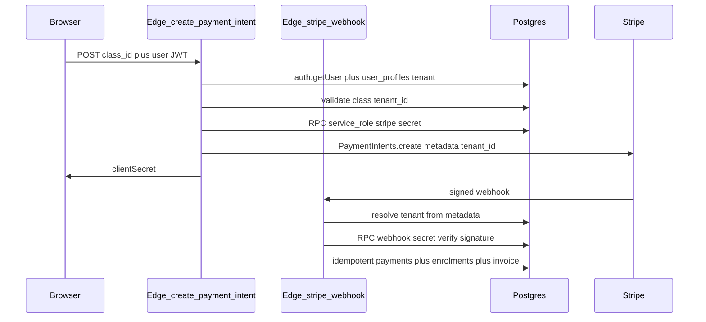

# Locked product and architecture decisions

These replace open choices from earlier drafts. **No further clarifications are required before implementation.**

| Topic | Decision | Rationale |
|-------|-----------|-----------|
| Stripe model | **Each school = own Standard Stripe account** (own Dashboard). **No Stripe Connect for V1.** | Matches SPEC pass-through; avoids Connect onboarding, KYC, and split payout complexity until you need contractor payouts. Keep `stripe_account_id` nullable for a future Connect phase. |
| Where keys are stored | **Tenant admin settings UI** + server-side encrypt-then-persist; API shows **key set / not set** and **last updated** only, never raw secret. | Scales past one school; industry norm; avoids SQL seed mistakes. |
| At-rest crypto | **Supabase Vault first** for master / secret material. **Fallback:** `pgcrypto` + `app.encryption_key` only if Vault is blocked—document in migration and migrate later. | Operational fit with Supabase; avoids dual crypto paths long-term. |
| Checkout auth | **V1 requires authenticated Supabase session** to create PaymentIntent. **Guest checkout** = follow-up (`checkout_session` + token + rate limits). | Minimizes fraud and trust bugs; matches current public classes surface (no anonymous pay path yet). |
| First finance migration | **`payments` + `invoice_sequences` + `next_invoice_number()` + tenant Stripe columns** only. **Omit** `discount_rules` and `teacher_pay_records` until a feature needs them. | Smallest correct slice for money + Israeli invoice sequencing + less RLS surface. |
| Language persistence | **Single persistence for user override:** `user_profiles.language` (in-app toggle = PATCH profile). **Precedence:** `profile.language` if NOT NULL, else `tenant.language_default`, else **`'he'`**. No parallel localStorage precedence (remove or sync localStorage to profile in same PR if UX needs instant toggle). | One source of truth; matches DB comments; avoids profile vs localStorage conflicts. |
| Webhook tenant resolution | **Require `metadata.tenant_id`** on PaymentIntent; webhook rejects production events without it. Optional later: lookup by `stripe_account_id` when Connect exists. | Standard accounts + one webhook URL; metadata is reliable when Connect is absent. |
| Notifications refactor | **Out of scope for P1**; schedule follow-up to move Twilio/Resend off platform env to per-tenant secrets. | One risky programme at a time; Stripe correctness first. |
| Evals / DoD | **Edit [.instructions.md](.instructions.md)** Definition of Done to **remove or defer** `packages/evals` until a real harness exists; note in [docs/IMPLEMENTATION_STATUS.md](docs/IMPLEMENTATION_STATUS.md). **Do not** add a stub `packages/evals` package. | Avoid process theater. |
| Observability | **Sentry** for React + Edge; **one Sentry project** with `environment: staging|production` **or** two projects—team choice at config only, not code shape. **Release** = git SHA from CI. | Single choice; fast SaaS baseline. |
| Sentry PII | **No** names, emails, phones, medical text in breadcrumbs; prefer opaque UUIDs; never log Stripe secrets; use scrubbing / `beforeSend`; consider lower **sample rate** in production if volume/cost bites. | Privacy law alignment + your own PII rules. |

---

# Part 1 — Codebase remediation (agent-ready)

## Preflight (mandatory first commits of the branch)

1. **SPEC vs DB diff:** [SPEC.md](SPEC.md) “Migration 008 — Payments” (lines ~1072+) and “Migration 010 — Invoice sequences” (lines ~1193+) define `payments`, `discount_rules`, `teacher_pay_records`, `invoice_sequences`, and `next_invoice_number()`. **Only** `payments`, `invoice_sequences`, and `next_invoice_number()` are in scope for the first migration slice; **`discount_rules` and `teacher_pay_records` are explicitly excluded** (see locked decisions). None of the in-scope objects exist yet in [supabase/migrations/](supabase/migrations/). [001_tenants.sql](supabase/migrations/001_tenants.sql) and [033_tenant_config_by_subdomain.sql](supabase/migrations/033_tenant_config_by_subdomain.sql) **do not** include SPEC’s Stripe columns. Do **not** assume a `SECURITY DEFINER` decrypt helper exists (grep confirmed **no** `pgp_sym_decrypt` / `encryption_key` in migrations).
2. **Trust model audit:** [send-notification/index.ts](supabase/functions/send-notification/index.ts) trusts `tenantId` from JSON and uses **service role** + **global** `RESEND_*` / `TWILIO_*` env vars. New Stripe code **must not** copy “client-supplied `tenantId` + service role” for money paths. **send-notification hardening is scheduled after P1** (locked); do not bundle unless capacity allows.

---

## P0 — `document.documentElement` + language precedence (correctness)

**Decisions (locked for implementation):**

| Precedence | Source | Notes |
|------------|--------|--------|
| 1 (highest) | Logged-in user | `user_profiles.language` when **NOT NULL** ([001_tenants.sql](supabase/migrations/001_tenants.sql) comment lines 43–44). In-app language control **updates this column** (see locked decisions). |
| 2 | Tenant default | `tenants.language_default` from [`useTenant`](apps/web/src/hooks/useTenant.ts) / view |
| 3 (fallback) | App | **`'he'`** — aligns with DB default on `tenants.language_default` and current [LanguageContext](apps/web/src/contexts/LanguageContext.tsx) behaviour |

**Implementation tasks:**

1. Add a **single** root sync (new small component mounted inside [`LanguageProvider`](apps/web/src/contexts/LanguageContext.tsx) or [`App.tsx`](apps/web/src/App.tsx) under provider) that sets `document.documentElement.lang` and `.dir` from the **resolved** `'he' \| 'en'` whenever it changes. Removes dependence on [`PublicNavigation`](apps/web/src/components/Navigation/PublicNavigation.tsx) calling [`useLanguage`](apps/web/src/hooks/useLanguage.ts) for document updates ([`SmartLayout`](apps/web/src/layouts/SmartLayout.tsx) + [`AuthCallbackPage`](apps/web/src/pages/AuthCallbackPage.tsx) gap).
2. **Wire DB profile language:** extend [`useCurrentUser`](apps/web/src/hooks/useCurrentUser.ts) / profile fetch to return `language`; extend [`UserProfile`](apps/web/src/types/auth.ts) with optional `language: 'he' \| 'en' \| null`. [`LanguageProvider`](apps/web/src/contexts/LanguageContext.tsx) resolves final language using the table above (after profile and tenant queries settle). **Reconcile localStorage:** either remove `userLanguagePreference` in favour of profile-only, or treat localStorage as a write-through cache that syncs to `user_profiles.language` once authenticated—**pick one implementation in the PR and avoid dual precedence.**
3. **Tenant null:** when `useTenant()` is `null` (no subdomain / dev misconfig), keep **HTML safe default** from [index.html](apps/web/index.html) until a language is resolved; then apply.
4. Strip **verbose block comments** from files touched in P0; prefer names and small helpers.

**Acceptance:** Logged-in user on `/` with `ProtectedNavigation` still gets `<html lang="he" dir="rtl">` when profile or tenant says Hebrew; `/auth/callback` same.

---

## P1 — Stripe and finance (correctness, revenue)

### P1.0 Architecture choices (locked)

- **Pass-through billing:** each tenant uses **own Standard Stripe account** keys. **No platform-wide live `STRIPE_SECRET_KEY`** for charging customers. CI may use Stripe **test** secrets in GitHub Actions only for automated smoke tests.
- **Tenant binding for Edge:** `create-payment-intent` **must not** accept free-form `tenantId` from the client. **V1:** require **Supabase user JWT** (`Authorization` header). Verify JWT (e.g. `auth.getUser` in Edge), load `tenant_id` from `user_profiles`, assert `classes.tenant_id` matches. **Guest checkout** is explicitly **out of scope** until a follow-up ships `checkout_session` + opaque token + rate limits.
- **Webhook verification:** one Edge URL; verify signature with **that tenant’s** webhook secret from RPC. **Resolve tenant by `event.data.object.metadata.tenant_id`** (required). Reject in production if missing. `stripe_account_id` on tenant remains nullable for a **future** Connect phase.

### P1.1 Database (additive migrations only)

New forward migration(s) after `034_*` (e.g. `035_finance_payments.sql`), **subset of SPEC Migration 008/010**:

- Add nullable columns to `tenants`: `stripe_publishable_key`, `stripe_secret_key_enc`, `stripe_webhook_secret_enc`, `stripe_account_id` (nullable, unused in V1 Standard flow). Align enc column type (TEXT vs BYTEA) in one chosen representation; document.
- `CREATE TABLE payments` as in SPEC (~1075–1110); indexes on `(tenant_id)`, `stripe_payment_intent_id` UNIQUE.
- `CREATE TABLE invoice_sequences` + `next_invoice_number(uuid)` from SPEC (~1199–1259) including **`FOR UPDATE`** semantics.
- **Do not** create `discount_rules` or `teacher_pay_records` in this slice.
- **RLS:** enable RLS on `payments` and `invoice_sequences`; policies for parents/admins; **Edge-only inserts** to `payments` via service role for webhook/intent completion path unless a narrow RPC is preferred—document choice.
- Extend [tenant_config_by_subdomain](supabase/migrations/033_tenant_config_by_subdomain.sql) view to expose **`stripe_publishable_key` only**.

### P1.2 Service-role-only secret access (Vault-first)

Add SQL function(s) e.g. `get_tenant_stripe_credentials(p_tenant_id uuid)` **SECURITY DEFINER** `SET search_path = public` that:

1. Asserts caller is **service role** (verify pattern against current Supabase docs).
2. Returns decrypted secret + webhook secret (and publishable if needed server-side only).

**Primary approach:** decrypt using **Supabase Vault** (document secret naming / key references in migration comments). **Fallback only if Vault cannot be used in your project:** `pgp_sym_decrypt(..., current_setting('app.encryption_key'))` per SPEC; same RPC surface so Edge code stays stable when you migrate Vault → pgcrypto or reverse.

**Encryption key material** is set only via manual runbook (Part 2), never committed.

### P1.3 Edge Functions

- **`create-payment-intent`:** Validate user JWT; resolve `tenant_id`; validate `class_id` belongs to tenant; compute amounts using `classes` price + `tenants.vat_rate`; create Stripe PaymentIntent with **`metadata.tenant_id`** (UUID string) and enrolment-related ids; return `clientSecret`. Pin Stripe SDK via `esm.sh` (match [send-notification](supabase/functions/send-notification/index.ts) style).
- **`stripe-webhook`:** Load webhook secret via RPC; verify signature; handle `payment_intent.succeeded` / `payment_intent.payment_failed` **idempotently**; update `enrolments`, insert `payments`, call `next_invoice_number`, `audit_log`; notifications optional.

### P1.4 Admin UI — tenant Stripe keys

- **Tenant admin only** (`tenant_admin` role): settings page or section under existing admin setup.
- Fields: publishable key (plaintext acceptable for pk_live/pk_test), secret key, webhook signing secret—**submit via Edge Function or RPC** that encrypts and writes `*_enc` columns; response must not echo secrets.
- Display: “Stripe secret: configured / not configured”, “Webhook secret: configured / not configured”, `updated_at` if tracked.

### P1.5 Frontend — checkout

- [apps/web/package.json](apps/web/package.json) already lists Stripe packages.
- Extend `TenantConfig` / [`useTenant`](apps/web/src/hooks/useTenant.ts) / view consumer for **publishable key** only.
- Replace placeholder in [EnrolmentStepper.tsx](apps/web/src/features/enrolment/components/EnrolmentStepper.tsx) with Payment Element; **require session** before payment step (redirect to login if needed); invalidate TanStack Query keys after success.

### P1.6 Types

- Regenerate [packages/shared/src/database.types.ts](packages/shared/src/database.types.ts) after migrations using **`SUPABASE_PROJECT_REF`** env (see P4 scripts).

**Acceptance:** Stripe test mode: intent succeeds once; duplicate webhook does not duplicate payment; enrolment becomes `active`; invoice number increments once; admin can configure keys without secrets in network responses.

---

## P2 — CI and TypeScript

- [`.github/workflows/ci.yml`](.github/workflows/ci.yml): accessibility job **must fail** on `develop` and `main` when UI paths change (remove `continue-on-error` for `develop` unless a documented exception is added in-file).
- Remove `any` / non-null assertions in [form.tsx](apps/web/src/components/ui/form.tsx), [checkbox.tsx](apps/web/src/components/ui/checkbox.tsx), [DashboardRedirectPage.tsx](apps/web/src/pages/DashboardRedirectPage.tsx), [DropdownMenu.tsx](apps/web/src/components/Navigation/DropdownMenu.tsx).

---

## P3 — Tokens and i18n

- Replace raw palette classes in enrolment / [SmartLayout](apps/web/src/layouts/SmartLayout.tsx) footer with semantic tokens; move footer copy to [he.json](apps/web/src/i18n/he.json) / [en.json](apps/web/src/i18n/en.json); strict i18n missing-key behaviour in dev ([i18n.ts](apps/web/src/i18n/i18n.ts)).

---

## P4 — Observability, docs, structure

- **Sentry:** React SDK + Edge (`@sentry/deno` or HTTP transport); `VITE_SENTRY_DSN` / `SENTRY_DSN`; **`environment`** tag `staging` | `production`; **`release`** = git SHA from CI. **PII:** apply locked scrub rules in `beforeSend` / Deno equivalent; no secrets in events.
- **React error boundary** at router root.
- **Scripts:** [package.json](package.json) `db:*` uses **`SUPABASE_PROJECT_REF`** env; add `.env.example` entry.
- **Docs:** [docs/plans/README.md](docs/plans/README.md) template; [docs/IMPLEMENTATION_STATUS.md](docs/IMPLEMENTATION_STATUS.md); patch [SPEC.md](SPEC.md) Section 1.12 / migration counts as needed.
- **Evals:** update [.instructions.md](.instructions.md) Definition of Done to **remove** the `packages/evals` gate until a real package exists; note in IMPLEMENTATION_STATUS.
- **Split** [EnrolmentStepper.tsx](apps/web/src/features/enrolment/components/EnrolmentStepper.tsx) after P1.

---

---

# Part 2 — Manual operations runbook (outside the codebase)

These steps **cannot** be completed by editing this repository alone. Record completion in [docs/IMPLEMENTATION_STATUS.md](docs/IMPLEMENTATION_STATUS.md).

## A. Supabase (project + secrets)

1. **Create or confirm** production and staging Supabase projects; region per [SPEC.md](SPEC.md) Section 5.3 (EU for Israel V1).
2. **Edge Function secrets:** `SUPABASE_URL`, `SUPABASE_SERVICE_ROLE_KEY` (auto). **No** global live Stripe keys for production tenant charges (per-tenant keys in DB only).
3. **Vault (preferred):** provision Vault secrets / naming convention per implementation doc in PR; document rotation.
4. **Fallback:** if Vault unavailable at launch, set `app.encryption_key` (or equivalent) per Supabase docs; backup key offline; **never commit**.
5. **Apply migrations** to staging then production; run **`pnpm db:types`** with `SUPABASE_PROJECT_REF` set.
6. **RLS smoke test** in Dashboard: parent JWT sees only allowed `payments` rows.

## B. Stripe (per school — Standard only for V1)

1. Each school: **Standard** Stripe account (own Dashboard). **Do not** onboard Connect for V1 unless you explicitly reopen scope.
2. **Keys:** tenant admin enters keys via **in-app admin UI** (production). For bootstrap only, staging may use Dashboard SQL with same encryption as app—avoid for production.
3. **Webhook:** point to deployed `stripe-webhook`; events: at least `payment_intent.succeeded`, `payment_intent.payment_failed`; store **signing secret per tenant** via admin UI.
4. **Test mode** on staging: full E2E; one `payments` row; `invoice_sequences` increments once.
5. **Go-live:** live keys + live webhook endpoint + re-verify secrets.

## C. Application / infrastructure URLs

1. **Wildcard DNS** for tenant subdomains; TLS (Vercel / Cloudflare / etc.).
2. **CORS:** production origins only where applicable.

## D. Legal and operational (Israel / UK per SPEC)

1. Privacy policy and terms live and linked.
2. Waiver text lawyer-approved; snapshot on enrolment if SPEC requires.
3. **Accountant:** export path for `payments` + invoice numbers.

## E. Quality gates (human)

1. **NVDA Hebrew** 15-minute smoke (per [.instructions.md](.instructions.md)) before production.
2. After CI change: confirm a11y failure blocks merge (dry-run on a branch).

## F. Scheduled follow-up (after P1 — recommended)

1. **send-notification:** migrate from platform `RESEND_*` / `TWILIO_*` env to **per-tenant** encrypted keys + fix trust model for `tenantId` (no client-spoofed tenant for sensitive sends).

---

## Out of scope (unless expanded)

- **Guest checkout** without JWT (`checkout_session` + token design).
- **Stripe Connect** for V1 (column may exist nullable for later).
- **`discount_rules` / `teacher_pay_records`** in first finance migration.
- **Multi-region** data sovereignty.
- **Stub `packages/evals`** package.

---

## Clarifications before start

**None.** All former open items are resolved by the **Locked product and architecture decisions** table and the deltas above. Implementation should treat that table as authoritative if it conflicts with older chat text.
