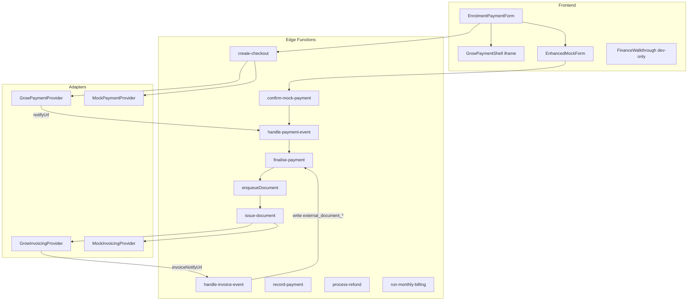

# Finance Module — Overview (Stages 1–9 baseline + Grow extension G0–G7)

This is the on-disk runbook for the finance module. Read this file, then the active
`stage-gN-*.md`, then `.instructions.md` before implementing any stage.

## Already shipped (Stages 1–9 baseline)

The vendor-agnostic finance core is implemented in code. Do **not** re-implement it:

- **Provider abstraction:** `supabase/functions/_shared/payments/` (registry, types,
  `finalise-payment`, `handle-payment-event`) and `supabase/functions/_shared/invoicing/`.
- **Adapters:** Mock + Stripe payment providers; Mock + Green Invoice invoicing providers.
- **Edge functions:** `create-checkout`, `handle-payment-event`, `record-payment`,
  `process-refund`, `issue-document`, `run-monthly-billing`, `get-enrolment-completion`.
- **Schema:** `supabase/migrations/20260608001600_finance.sql` (frozen — see migration policy).

## Extension track (this plan): G0–G7

The Grow extension delivers a reliable mock/demo path, then integrates **Grow (Meshulam)**
as the **Israel bundled default** (`payment_provider=grow`, `invoicing_provider=grow`) while
keeping the code vendor-generic (adapters only; no Grow names in schema or orchestration).

| Stage | Focus | Doc |
|-------|-------|-----|
| G0 | Test harness + pipeline fixes (defer mock, confirm-mock-payment, tenant RPC slugs) | [stage-g0-test-harness.md](stage-g0-test-harness.md) |
| G1 | Admin finance UI + canonical offline path | [stage-g1-admin-finance.md](stage-g1-admin-finance.md) |
| G2 | Finance walkthrough + enhanced mock UX | [stage-g2-walkthrough.md](stage-g2-walkthrough.md) |
| G3 | Grow registry, credentials RPC, mock Grow adapter | [stage-g3-grow-registry.md](stage-g3-grow-registry.md) |
| G4 | Grow payment adapter, webhooks, bundled orchestration | [stage-g4-grow-backend.md](stage-g4-grow-backend.md) |
| G5 | Grow frontend checkout shell | [stage-g5-grow-frontend.md](stage-g5-grow-frontend.md) |
| G6 | Grow recurring billing + refund polish | [stage-g6-recurring-refunds.md](stage-g6-recurring-refunds.md) |
| G7 | Grow settings, cleanup, production readiness | [stage-g7-settings-cleanup.md](stage-g7-settings-cleanup.md) |

## Extension track (planned): iCount I0–I6

Add **iCount** as bundled IL default for **new** tenants; **Grow stays**. **Dual tracks** — integration + silent signup — see [icount/00-overview.md](icount/00-overview.md).

| Phase | Focus | Account? |
|-------|-------|----------|
| I0-doc | Draft SPIKE-ADR + fixtures | No ✅ |
| I1 | Registry, mock, credential RPC | No ✅ |
| I3 → I2a | UI + document webhook (mock) | No — **next** |
| I6-research | Partner API / silent signup research | No — **parallel** |
| I0-live | IPN capture + ADR approval + rate limits | **Yes** |
| I2b → I5 | Live IPN, defaults, seed flip | Yes |
| I6-impl | Silent provisioning | Partner creds — **V1 complete** |

Docs: [icount/00-overview.md](icount/00-overview.md) · [SPIKE-ADR.md](icount/SPIKE-ADR.md) · [PROVIDER-ISOLATION-TDD.md](icount/PROVIDER-ISOLATION-TDD.md) · [stage-i6-silent-provisioning.md](icount/stage-i6-silent-provisioning.md)

## Architecture (target state after G7)

## Cross-stage rules

- **One stage per agent session.** Stop after the stage DoD; wait for the user to say
  "commit Stage GN". No `git commit`/`git push` unless explicitly requested.
- **Single success path:** `finalise-payment` + `enqueueDocument`. Bundled skip (G4): when
  `payment_provider === invoicing_provider === 'grow'` and the payment row already has
  `external_document_id`, call `finalisePayment({ skipDocumentEnqueue: true })`.
- **No AI in money logic.** Deterministic TDD for all adapters.
- **Schema frozen.** No new tables. RPC-only changes allowed (Grow credentials).
- **Migration policy:** never edit a shipped migration in place. Add a new numbered
  migration under `supabase/migrations/` per stage that needs SQL/RPC. Run `pnpm db:sync`
  only when the stage doc says so and the user has confirmed (G0/G3).
- **Mock in CI; real Grow sandbox only in manual runbook steps.** Linked remote dev only —
  no local Docker / `supabase start`.

## Webhook ordering (G4 — mandatory)

Payment and invoice webhooks are async and may arrive in either order:

1. **Payment webhook** → `handlePaymentEventInternal` → `finalisePayment` → enqueue **only
   if** `external_document_id` is still null.
2. **Invoice webhook** → `handle-invoice-event` → upsert `external_document_*` on the payment
   by `provider_payment_ref`; if a pending `document_queue` row exists, mark it succeeded (do
   not re-issue).
3. Never call `finalisePayment` from the invoice webhook (avoids double activation/email).

## Cash / offline (G1+)

Always via `record-payment` → `finalisePayment` → `enqueueDocument`. For Grow tenants
without a standalone document API, `GrowInvoicingProvider.issueDocument` throws a
**non-retryable** `InvoicingProviderError` with a runbook message; dev/mock tenants keep
`invoicing_provider=mock` for cash QA until the API is confirmed.

## Per-session workflow

1. Read `00-overview.md` + the active `stage-gN-*.md` + `.instructions.md`.
2. Implement **only** that stage's scope.
3. Run stage tests + `pnpm -C apps/web test` (+ Playwright if the stage specifies).
4. Return the DoD checklist (pass/fail), files changed, commands run, blockers.
5. **Stop** — wait for the user to say "commit Stage GN".
