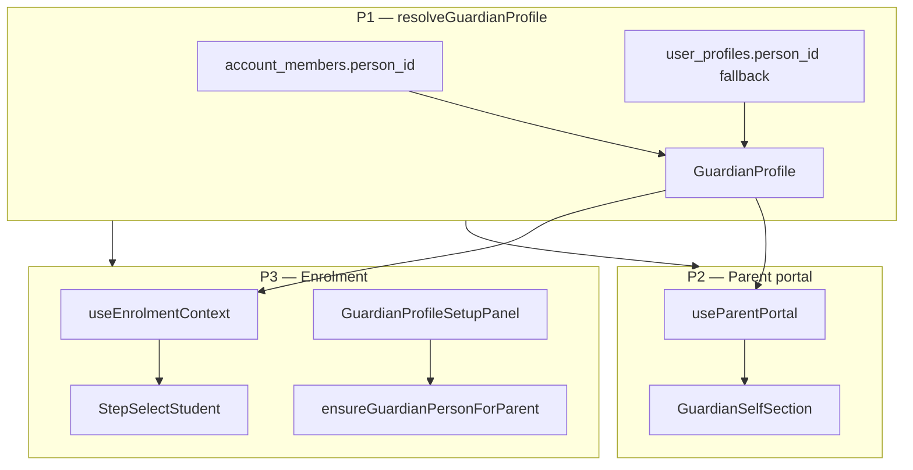

# Parent self-enrolment — Overview (Stages P1–P3)

**SPEC:** Phase 1G-adjacent — parent portal self-enrolment for adult classes  
**Status:** ✅ Complete (2026-06-28) — shipped `f0c327a` on `feat/UI-fixes`  
**Normative:** [CONTRACTS.md](CONTRACTS.md) (locked)  
**Related:** [parent-portal-polish.md](../parent-portal-polish.md) (notifications/upcoming — separate)

## Agent entry point

1. Read [CONTRACTS.md](CONTRACTS.md) (mandatory).
2. Read this file + active `stage-pN-*.md`.
3. Read `.instructions.md`.
4. Run `pnpm parent-self-enrolment:prompt pN` and paste into Agent.

Rule file: `.cursor/rules/parent-self-enrolment.mdc`.

## Problem summary

Guardian person records exist for login/waiver attribution but are **excluded** from the parent portal child list (`account_id = NULL`). Enrolment **Myself** depends on a fragile `getGuardianProfile` path. Parents enrolling in adult classes hit a dead end when resolution fails.

## Stage map

| Stage | Focus | SQL | Doc |
| --- | --- | --- | --- |
| P1 | Canonical `resolveGuardianProfile` + service refactor | None | [stage-p1-guardian-resolution.md](stage-p1-guardian-resolution.md) |
| P2 | Portal **Myself** section + `useParentPortal` | None | [stage-p2-portal-myself.md](stage-p2-portal-myself.md) |
| P3 | Enrolment Myself hardening + adult profile setup panel | None | [stage-p3-enrolment-safety-net.md](stage-p3-enrolment-safety-net.md) |

**Order:** P1 → P2 → P3. One stage per agent session.

## Architecture

## Already shipped (do not re-implement)

- `StepSelectStudent` Myself UI when `guardian` prop is set (`pages.enrolment.enrol_myself`)
- `filterStudentCandidates` excludes guardian from child list
- `EnrollmentIntent.personId` + `canSkipPersonStep`
- `createMinorWithFamily` guardian without `account_id`
- Seed parent with guardian person (`supabase/seed.sql` Miriam row)

## Out of scope

- Contact preferences / upcoming sessions (parent-portal-polish)
- Admin “create new adult” in parent mode
- DB schema changes

## Completion (whole epic)

Update `docs/IMPLEMENTATION_STATUS.md` after P3 only.
